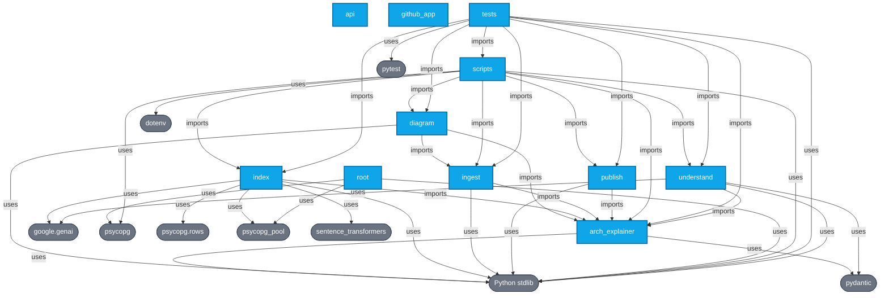

# System Architecture

High-level view of modules and the external libraries they depend on (standard library collapsed into one node).

```mermaid
graph TD
  api["api"]
  arch_explainer["arch_explainer"]
  diagram["diagram"]
  github_app["github_app"]
  index["index"]
  ingest["ingest"]
  publish["publish"]
  root["root"]
  scripts["scripts"]
  tests["tests"]
  understand["understand"]
  ext_dotenv(["dotenv"])
  ext_google_genai(["google.genai"])
  ext_psycopg(["psycopg"])
  ext_psycopg_rows(["psycopg.rows"])
  ext_psycopg_pool(["psycopg_pool"])
  ext_pydantic(["pydantic"])
  ext_pytest(["pytest"])
  ext_sentence_transformers(["sentence_transformers"])
  ext_stdlib(["Python stdlib"])
  arch_explainer -->|uses| ext_stdlib
  arch_explainer -->|uses| ext_pydantic
  diagram -->|uses| ext_stdlib
  diagram -->|imports| arch_explainer
  diagram -->|imports| ingest
  index -->|uses| ext_stdlib
  index -->|imports| arch_explainer
  index -->|uses| ext_google_genai
  index -->|uses| ext_sentence_transformers
  index -->|uses| ext_psycopg_pool
  index -->|uses| ext_psycopg_rows
  ingest -->|uses| ext_stdlib
  ingest -->|imports| arch_explainer
  publish -->|uses| ext_stdlib
  publish -->|imports| arch_explainer
  root -->|uses| ext_stdlib
  root -->|uses| ext_psycopg
  root -->|uses| ext_psycopg_pool
  scripts -->|uses| ext_stdlib
  scripts -->|uses| ext_dotenv
  scripts -->|uses| ext_psycopg
  scripts -->|imports| diagram
  scripts -->|imports| ingest
  scripts -->|imports| arch_explainer
  scripts -->|imports| publish
  scripts -->|imports| understand
  scripts -->|imports| index
  tests -->|uses| ext_pytest
  tests -->|uses| ext_stdlib
  tests -->|imports| diagram
  tests -->|imports| arch_explainer
  tests -->|imports| index
  tests -->|imports| ingest
  tests -->|imports| scripts
  tests -->|imports| understand
  tests -->|imports| publish
  understand -->|uses| ext_stdlib
  understand -->|uses| ext_pydantic
  understand -->|uses| ext_google_genai
  understand -->|imports| arch_explainer
  classDef moduleNode fill:#0ea5e9,color:#fff,stroke:#0369a1,stroke-width:2px;
  class api,arch_explainer,diagram,github_app,index,ingest,publish,root,scripts,tests,understand moduleNode;
  classDef externalNode fill:#6b7280,color:#fff,stroke:#374151,stroke-width:1px;
  class ext_dotenv,ext_google_genai,ext_psycopg,ext_psycopg_rows,ext_psycopg_pool,ext_pydantic,ext_pytest,ext_sentence_transformers,ext_stdlib externalNode;
```
