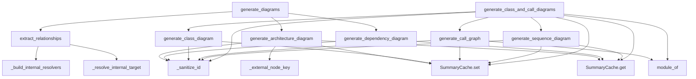

# Function Call Graph: diagram

Which functions/methods call which others, resolved to repo-internal definitions only.

```mermaid
graph TD
  extract_relationships["extract_relationships"]
  build_internal_resolvers["_build_internal_resolvers"]
  resolve_internal_target["_resolve_internal_target"]
  generate_architecture_diagram["generate_architecture_diagram"]
  sanitize_id["_sanitize_id"]
  external_node_key["_external_node_key"]
  SummaryCache_set["SummaryCache.set"]
  SummaryCache_get["SummaryCache.get"]
  generate_dependency_diagram["generate_dependency_diagram"]
  generate_diagrams["generate_diagrams"]
  generate_class_diagram["generate_class_diagram"]
  generate_call_graph["generate_call_graph"]
  module_of["module_of"]
  generate_sequence_diagram["generate_sequence_diagram"]
  generate_class_and_call_diagrams["generate_class_and_call_diagrams"]
  extract_relationships --> build_internal_resolvers
  extract_relationships --> resolve_internal_target
  generate_architecture_diagram --> sanitize_id
  generate_architecture_diagram --> external_node_key
  generate_architecture_diagram --> SummaryCache_set
  generate_architecture_diagram --> SummaryCache_get
  generate_dependency_diagram --> sanitize_id
  generate_dependency_diagram --> SummaryCache_get
  generate_diagrams --> extract_relationships
  generate_diagrams --> generate_architecture_diagram
  generate_diagrams --> generate_dependency_diagram
  generate_class_diagram --> SummaryCache_set
  generate_class_diagram --> sanitize_id
  generate_call_graph --> module_of
  generate_call_graph --> sanitize_id
  generate_call_graph --> SummaryCache_set
  generate_sequence_diagram --> SummaryCache_set
  generate_sequence_diagram --> SummaryCache_get
  generate_sequence_diagram --> sanitize_id
  generate_class_and_call_diagrams --> generate_class_diagram
  generate_class_and_call_diagrams --> generate_call_graph
  generate_class_and_call_diagrams --> module_of
  generate_class_and_call_diagrams --> SummaryCache_set
  generate_class_and_call_diagrams --> SummaryCache_get
  generate_class_and_call_diagrams --> sanitize_id
  generate_class_and_call_diagrams --> generate_sequence_diagram
```
