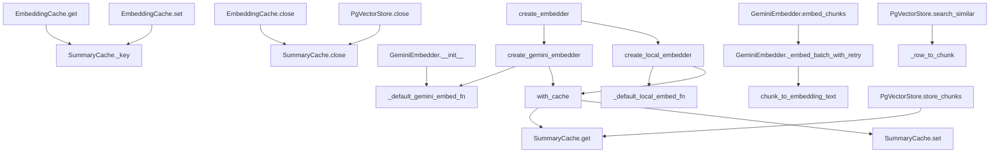

# Function Call Graph: index

Which functions/methods call which others, resolved to repo-internal definitions only.

```mermaid
graph TD
  EmbeddingCache_get["EmbeddingCache.get"]
  SummaryCache_key["SummaryCache._key"]
  EmbeddingCache_set["EmbeddingCache.set"]
  EmbeddingCache_close["EmbeddingCache.close"]
  SummaryCache_close["SummaryCache.close"]
  with_cache["with_cache"]
  SummaryCache_get["SummaryCache.get"]
  SummaryCache_set["SummaryCache.set"]
  GeminiEmbedder_init["GeminiEmbedder.__init__"]
  default_gemini_embed_fn["_default_gemini_embed_fn"]
  GeminiEmbedder_embed_chunks["GeminiEmbedder.embed_chunks"]
  GeminiEmbedder_embed_batch_with_retry["GeminiEmbedder._embed_batch_with_retry"]
  chunk_to_embedding_text["chunk_to_embedding_text"]
  create_gemini_embedder["create_gemini_embedder"]
  create_local_embedder["create_local_embedder"]
  default_local_embed_fn["_default_local_embed_fn"]
  create_embedder["create_embedder"]
  PgVectorStore_store_chunks["PgVectorStore.store_chunks"]
  PgVectorStore_search_similar["PgVectorStore.search_similar"]
  row_to_chunk["_row_to_chunk"]
  PgVectorStore_close["PgVectorStore.close"]
  EmbeddingCache_get --> SummaryCache_key
  EmbeddingCache_set --> SummaryCache_key
  EmbeddingCache_close --> SummaryCache_close
  with_cache --> SummaryCache_get
  with_cache --> SummaryCache_set
  GeminiEmbedder_init --> default_gemini_embed_fn
  GeminiEmbedder_embed_chunks --> GeminiEmbedder_embed_batch_with_retry
  GeminiEmbedder_embed_batch_with_retry --> chunk_to_embedding_text
  create_gemini_embedder --> default_gemini_embed_fn
  create_gemini_embedder --> with_cache
  create_local_embedder --> default_local_embed_fn
  create_local_embedder --> with_cache
  create_embedder --> create_gemini_embedder
  create_embedder --> create_local_embedder
  PgVectorStore_store_chunks --> SummaryCache_get
  PgVectorStore_search_similar --> row_to_chunk
  PgVectorStore_close --> SummaryCache_close
```
