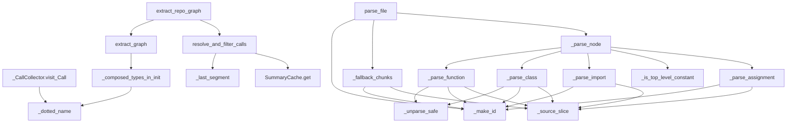

# Function Call Graph: ingest

Which functions/methods call which others, resolved to repo-internal definitions only.

```mermaid
graph TD
  CallCollector_visit_Call["_CallCollector.visit_Call"]
  dotted_name["_dotted_name"]
  composed_types_in_init["_composed_types_in_init"]
  extract_graph["extract_graph"]
  resolve_and_filter_calls["resolve_and_filter_calls"]
  last_segment["_last_segment"]
  SummaryCache_get["SummaryCache.get"]
  extract_repo_graph["extract_repo_graph"]
  parse_file["parse_file"]
  make_id["_make_id"]
  fallback_chunks["_fallback_chunks"]
  parse_node["_parse_node"]
  source_slice["_source_slice"]
  parse_function["_parse_function"]
  parse_class["_parse_class"]
  parse_import["_parse_import"]
  is_top_level_constant["_is_top_level_constant"]
  parse_assignment["_parse_assignment"]
  unparse_safe["_unparse_safe"]
  CallCollector_visit_Call --> dotted_name
  composed_types_in_init --> dotted_name
  extract_graph --> composed_types_in_init
  resolve_and_filter_calls --> last_segment
  resolve_and_filter_calls --> SummaryCache_get
  extract_repo_graph --> extract_graph
  extract_repo_graph --> resolve_and_filter_calls
  parse_file --> make_id
  parse_file --> fallback_chunks
  parse_file --> parse_node
  fallback_chunks --> make_id
  fallback_chunks --> source_slice
  parse_node --> parse_function
  parse_node --> parse_class
  parse_node --> parse_import
  parse_node --> is_top_level_constant
  parse_node --> parse_assignment
  parse_function --> unparse_safe
  parse_function --> make_id
  parse_function --> source_slice
  parse_class --> unparse_safe
  parse_class --> make_id
  parse_class --> source_slice
  parse_import --> make_id
  parse_import --> source_slice
  parse_assignment --> make_id
  parse_assignment --> source_slice
```
