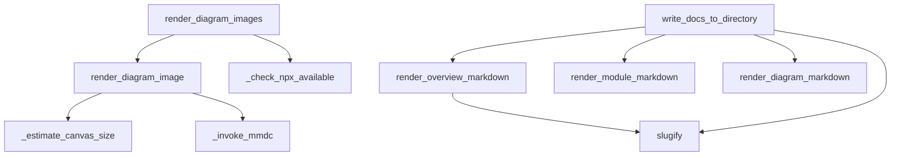

# Function Call Graph: publish

Which functions/methods call which others, resolved to repo-internal definitions only.

```mermaid
graph TD
  render_diagram_image["render_diagram_image"]
  estimate_canvas_size["_estimate_canvas_size"]
  invoke_mmdc["_invoke_mmdc"]
  render_diagram_images["render_diagram_images"]
  check_npx_available["_check_npx_available"]
  render_overview_markdown["render_overview_markdown"]
  slugify["slugify"]
  write_docs_to_directory["write_docs_to_directory"]
  render_module_markdown["render_module_markdown"]
  render_diagram_markdown["render_diagram_markdown"]
  render_diagram_image --> estimate_canvas_size
  render_diagram_image --> invoke_mmdc
  render_diagram_images --> check_npx_available
  render_diagram_images --> render_diagram_image
  render_overview_markdown --> slugify
  write_docs_to_directory --> render_overview_markdown
  write_docs_to_directory --> slugify
  write_docs_to_directory --> render_module_markdown
  write_docs_to_directory --> render_diagram_markdown
```
