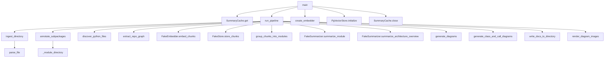

# Function Call Graph: scripts

Which functions/methods call which others, resolved to repo-internal definitions only.

```mermaid
graph TD
  main["main"]
  SummaryCache_get["SummaryCache.get"]
  ingest_directory["ingest_directory"]
  parse_file["parse_file"]
  annotate_subpackages["annotate_subpackages"]
  module_directory["_module_directory"]
  run_pipeline["run_pipeline"]
  discover_python_files["discover_python_files"]
  extract_repo_graph["extract_repo_graph"]
  FakeEmbedder_embed_chunks["FakeEmbedder.embed_chunks"]
  FakeStore_store_chunks["FakeStore.store_chunks"]
  group_chunks_into_modules["group_chunks_into_modules"]
  FakeSummarizer_summarize_module["FakeSummarizer.summarize_module"]
  FakeSummarizer_summarize_architecture_overview["FakeSummarizer.summarize_architecture_overview"]
  generate_diagrams["generate_diagrams"]
  generate_class_and_call_diagrams["generate_class_and_call_diagrams"]
  write_docs_to_directory["write_docs_to_directory"]
  render_diagram_images["render_diagram_images"]
  create_embedder["create_embedder"]
  PgVectorStore_initialize["PgVectorStore.initialize"]
  SummaryCache_close["SummaryCache.close"]
  main --> SummaryCache_get
  ingest_directory --> parse_file
  annotate_subpackages --> module_directory
  run_pipeline --> discover_python_files
  run_pipeline --> ingest_directory
  run_pipeline --> extract_repo_graph
  run_pipeline --> FakeEmbedder_embed_chunks
  run_pipeline --> FakeStore_store_chunks
  run_pipeline --> group_chunks_into_modules
  run_pipeline --> FakeSummarizer_summarize_module
  run_pipeline --> annotate_subpackages
  run_pipeline --> FakeSummarizer_summarize_architecture_overview
  run_pipeline --> generate_diagrams
  run_pipeline --> generate_class_and_call_diagrams
  run_pipeline --> write_docs_to_directory
  run_pipeline --> render_diagram_images
  main --> create_embedder
  main --> PgVectorStore_initialize
  main --> run_pipeline
  main --> SummaryCache_close
```
