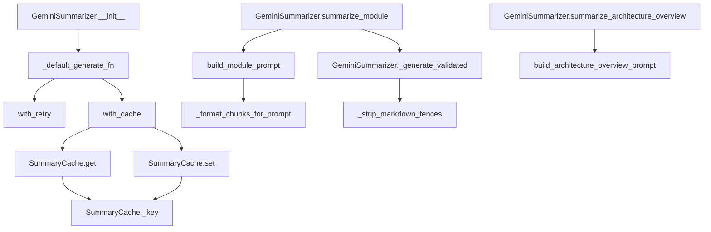

# Function Call Graph: understand

Which functions/methods call which others, resolved to repo-internal definitions only.

```mermaid
graph TD
  build_module_prompt["build_module_prompt"]
  format_chunks_for_prompt["_format_chunks_for_prompt"]
  SummaryCache_get["SummaryCache.get"]
  SummaryCache_key["SummaryCache._key"]
  SummaryCache_set["SummaryCache.set"]
  with_cache["with_cache"]
  GeminiSummarizer_init["GeminiSummarizer.__init__"]
  default_generate_fn["_default_generate_fn"]
  GeminiSummarizer_summarize_module["GeminiSummarizer.summarize_module"]
  GeminiSummarizer_generate_validated["GeminiSummarizer._generate_validated"]
  GeminiSummarizer_summarize_architecture_overview["GeminiSummarizer.summarize_architecture_overview"]
  build_architecture_overview_prompt["build_architecture_overview_prompt"]
  strip_markdown_fences["_strip_markdown_fences"]
  with_retry["with_retry"]
  build_module_prompt --> format_chunks_for_prompt
  SummaryCache_get --> SummaryCache_key
  SummaryCache_set --> SummaryCache_key
  with_cache --> SummaryCache_get
  with_cache --> SummaryCache_set
  GeminiSummarizer_init --> default_generate_fn
  GeminiSummarizer_summarize_module --> build_module_prompt
  GeminiSummarizer_summarize_module --> GeminiSummarizer_generate_validated
  GeminiSummarizer_summarize_architecture_overview --> build_architecture_overview_prompt
  GeminiSummarizer_generate_validated --> strip_markdown_fences
  default_generate_fn --> with_retry
  default_generate_fn --> with_cache
```
