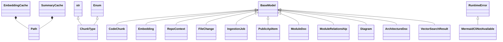

# Class Relationships (whole repo)

Inheritance and composition between classes. 10 class(es) with no detected relationship are omitted from this view.

```mermaid
classDiagram
  class EmbeddingCache
  class ChunkType
  class CodeChunk
  class Embedding
  class RepoContext
  class FileChange
  class IngestionJob
  class PublicApiItem
  class ModuleDoc
  class ModuleRelationship
  class Diagram
  class ArchitectureDoc
  class VectorSearchResult
  class MermaidCliNotAvailable
  class SummaryCache
  EmbeddingCache *-- Path
  str <|-- ChunkType
  Enum <|-- ChunkType
  BaseModel <|-- CodeChunk
  BaseModel <|-- Embedding
  BaseModel <|-- RepoContext
  BaseModel <|-- FileChange
  BaseModel <|-- IngestionJob
  BaseModel <|-- PublicApiItem
  BaseModel <|-- ModuleDoc
  BaseModel <|-- ModuleRelationship
  BaseModel <|-- Diagram
  BaseModel <|-- ArchitectureDoc
  BaseModel <|-- VectorSearchResult
  RuntimeError <|-- MermaidCliNotAvailable
  SummaryCache *-- Path
```
