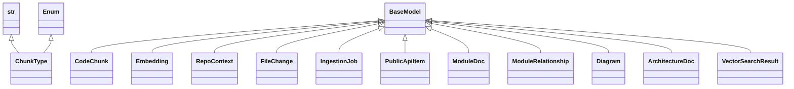

# Class Relationships: arch_explainer

Inheritance and composition between classes.

```mermaid
classDiagram
  class ChunkType
  class CodeChunk
  class Embedding
  class RepoContext
  class FileChange
  class IngestionJob
  class PublicApiItem
  class ModuleDoc
  class ModuleRelationship
  class Diagram
  class ArchitectureDoc
  class VectorSearchResult
  str <|-- ChunkType
  Enum <|-- ChunkType
  BaseModel <|-- CodeChunk
  BaseModel <|-- Embedding
  BaseModel <|-- RepoContext
  BaseModel <|-- FileChange
  BaseModel <|-- IngestionJob
  BaseModel <|-- PublicApiItem
  BaseModel <|-- ModuleDoc
  BaseModel <|-- ModuleRelationship
  BaseModel <|-- Diagram
  BaseModel <|-- ArchitectureDoc
  BaseModel <|-- VectorSearchResult
```
