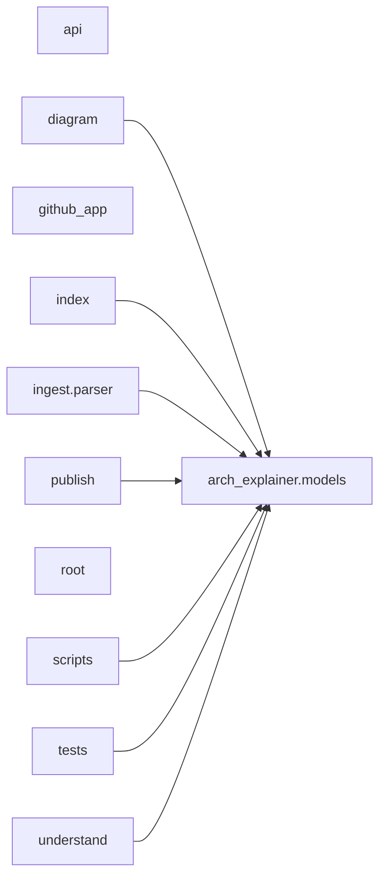

# Module Dependencies

Which modules in this repo depend on which others.

```mermaid
graph LR
  api["api"]
  arch_explainer_models["arch_explainer.models"]
  diagram["diagram"]
  github_app["github_app"]
  index["index"]
  ingest_parser["ingest.parser"]
  publish["publish"]
  root["root"]
  scripts["scripts"]
  tests["tests"]
  understand["understand"]
  diagram --> arch_explainer_models
  index --> arch_explainer_models
  ingest_parser --> arch_explainer_models
  publish --> arch_explainer_models
  scripts --> arch_explainer_models
  tests --> arch_explainer_models
  understand --> arch_explainer_models
```
