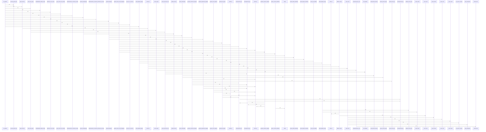

# Call Sequence: run_pipeline

Traced call sequence starting from run_pipeline, depth-limited to 4.

```mermaid
sequenceDiagram
  run_pipeline->>+discover_python_files: call
  run_pipeline->>+ingest_directory: call
  run_pipeline->>+extract_repo_graph: call
  run_pipeline->>+FakeEmbedder_embed_chunks: call
  run_pipeline->>+FakeStore_store_chunks: call
  run_pipeline->>+group_chunks_into_modules: call
  run_pipeline->>+FakeSummarizer_summarize_module: call
  run_pipeline->>+annotate_subpackages: call
  run_pipeline->>+FakeSummarizer_summarize_architecture_overview: call
  run_pipeline->>+generate_diagrams: call
  run_pipeline->>+generate_class_and_call_diagrams: call
  run_pipeline->>+write_docs_to_directory: call
  run_pipeline->>+render_diagram_images: call
  ingest_directory->>+parse_file: call
  extract_repo_graph->>+extract_graph: call
  extract_repo_graph->>+resolve_and_filter_calls: call
  annotate_subpackages->>+module_directory: call
  generate_diagrams->>+extract_relationships: call
  generate_diagrams->>+generate_architecture_diagram: call
  generate_diagrams->>+generate_dependency_diagram: call
  generate_class_and_call_diagrams->>+generate_class_diagram: call
  generate_class_and_call_diagrams->>+generate_call_graph: call
  generate_class_and_call_diagrams->>+module_of: call
  generate_class_and_call_diagrams->>+SummaryCache_set: call
  generate_class_and_call_diagrams->>+SummaryCache_get: call
  generate_class_and_call_diagrams->>+sanitize_id: call
  generate_class_and_call_diagrams->>+generate_sequence_diagram: call
  write_docs_to_directory->>+render_overview_markdown: call
  write_docs_to_directory->>+slugify: call
  write_docs_to_directory->>+render_module_markdown: call
  write_docs_to_directory->>+render_diagram_markdown: call
  render_diagram_images->>+check_npx_available: call
  render_diagram_images->>+render_diagram_image: call
  parse_file->>+make_id: call
  parse_file->>+fallback_chunks: call
  parse_file->>+parse_node: call
  extract_graph->>+composed_types_in_init: call
  resolve_and_filter_calls->>+last_segment: call
  resolve_and_filter_calls->>+SummaryCache_get: call
  extract_relationships->>+build_internal_resolvers: call
  extract_relationships->>+resolve_internal_target: call
  generate_architecture_diagram->>+sanitize_id: call
  generate_architecture_diagram->>+external_node_key: call
  generate_architecture_diagram->>+SummaryCache_set: call
  generate_architecture_diagram->>+SummaryCache_get: call
  generate_dependency_diagram->>+sanitize_id: call
  generate_dependency_diagram->>+SummaryCache_get: call
  generate_class_diagram->>+SummaryCache_set: call
  generate_class_diagram->>+sanitize_id: call
  generate_call_graph->>+module_of: call
  generate_call_graph->>+sanitize_id: call
  generate_call_graph->>+SummaryCache_set: call
  SummaryCache_set->>+SummaryCache_key: call
  SummaryCache_get->>+SummaryCache_key: call
  generate_sequence_diagram->>+SummaryCache_set: call
  generate_sequence_diagram->>+SummaryCache_get: call
  generate_sequence_diagram->>+sanitize_id: call
  render_overview_markdown->>+slugify: call
  render_diagram_image->>+estimate_canvas_size: call
  render_diagram_image->>+invoke_mmdc: call
  fallback_chunks->>+make_id: call
  fallback_chunks->>+source_slice: call
  parse_node->>+parse_function: call
  parse_node->>+parse_class: call
  parse_node->>+parse_import: call
  parse_node->>+is_top_level_constant: call
  parse_node->>+parse_assignment: call
  composed_types_in_init->>+dotted_name: call
```
